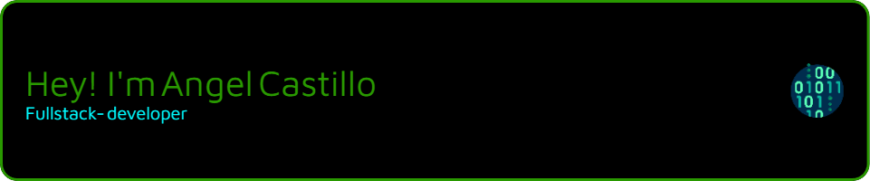

# 

   

### Skills

## Welcome to my GitHub Profile 💻

I'm **Angel Castillo**, a full-stack developer with experience in robust and scalable technologies.

- 🔭 I am currently focused on developing applications using Java and Spring Boot, working on creating robust and efficient systems with well-defined architecture.
- 🌱 I am deepening my knowledge in integrating distributed systems and optimizing performance in enterprise applications.
- 👯 I am interested in collaborating on open-source projects that utilize Java, Spring Boot, and other relevant technologies for large-scale software development.
- 🤔 I am seeking support to advance in implementing advanced design patterns and managing databases in high-availability environments.
- 💬 Feel free to ask me about software development, system architecture, API integration, or best practices in development with Spring Boot.
- 😄 Pronouns: He/Him
- ⚡ Fun fact: I enjoy solving complex programming problems and exploring new tools and technologies to enhance development efficiency.

Feel free to explore my repositories and reach out if you have any questions or want to collaborate on open-source projects.